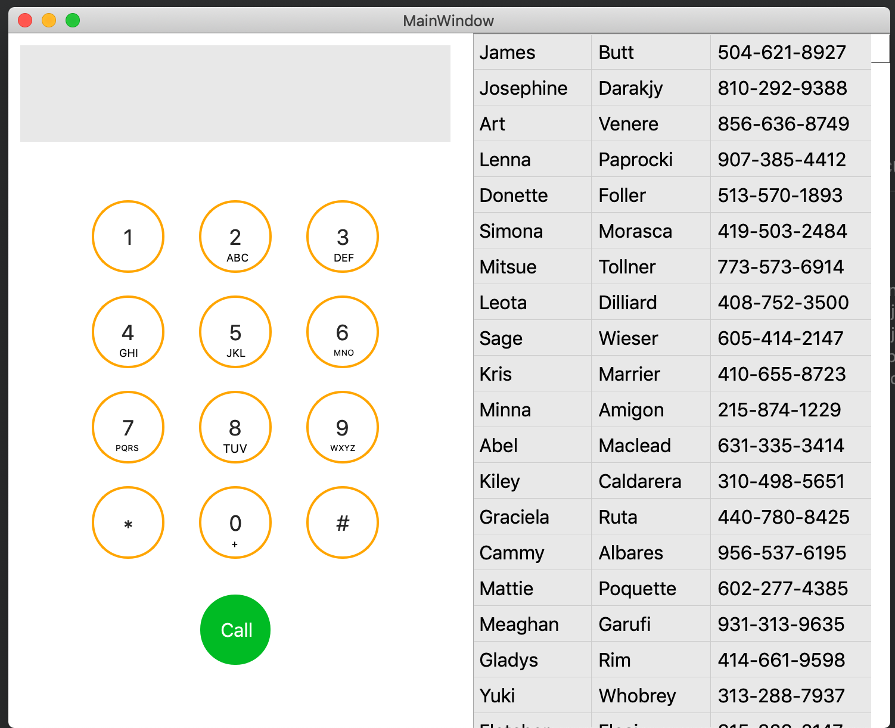

# Phone Dialer App

Dailier App created with Qt as part of Applications Development class, Spring 2019

## App

Inline-style: 



### Prerequisites

What things you need to install the software and how to install them

```
Give examples
```

### Installing

A step by step series of examples that tell you how to get a development env running

Say what the step will be

```
Give the example
```